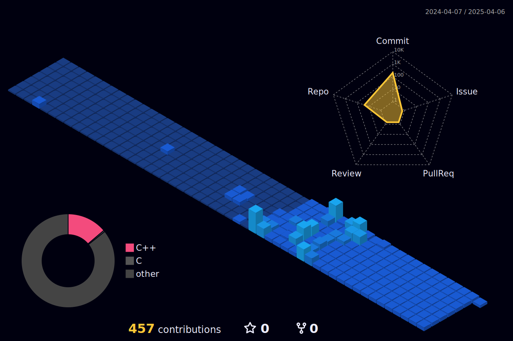

### ✨ Aaron's Github Profile ✨

Welcome to my GitHub space. Feel free to contribute to or fork any public repositories.
I encourage you to explore and experiment with repositories that pique your interest.

- 🌱 You can learn more about me at my website, [Aaron Codes](https://aaron-codes.io/).
- 👯 I'm an advocate of open-source and I'm not wedded to any particular language. Each language has been developed for specific reasons, so I'm always seeking to use the most appropriate langauge to best solve the problem at hand.

<!--Code Wars-->

<!--   green snake -->

